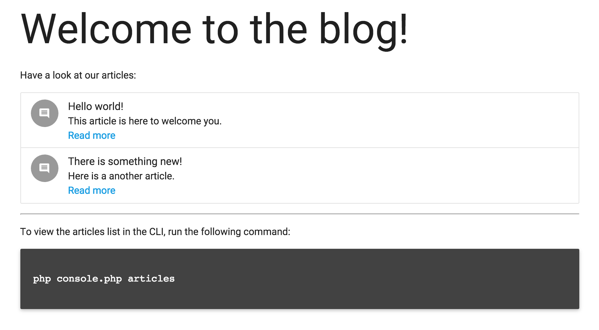

# PHP-DI application demo

This repository demonstrates how to write a simple application using PHP-DI without any framework.

## Screenshot



## Disclaimer

Watch out, this project is meant to show how to build an application from scratch with PHP-DI in the simplest way possible. Be aware that this code is only meant for learning purposes and should probably not go to production as-is.

Improvements and pull requests are welcome.

## Run

To run this demo, you need to clone it and install dependencies:

```
git clone https://github.com/PHP-DI/demo.git
cd demo/
composer install
```

You can then run the web application using PHP's built-in server:

```
php -S 0.0.0.0:8000 -t web/
```

The web application is running at [http://localhost:8000](http://localhost:8000/).

You can also run the CLI application:

```
php console.php
```

The following commands are available:

- `php console.php articles`: lists the blog articles
- `php console.php article [id]`: displays a blog article by its ID

## Architecture

The container is created in [app/bootstrap.php](app/bootstrap.php). The configuration file for the container is [app/config.php](app/config.php).

Both the web application and the CLI application require `app/bootstrap.php` to get the container:

- the web application ([web/index.php](web/index.php)) uses [FastRoute](https://github.com/nikic/FastRoute) for routing, and then creates and invokes the controller using PHP-DI
- the CLI application ([console.php](console.php)) uses [Silly](http://mnapoli.fr/silly/): Silly uses the container to create and invoke the commands

You will note that in both case, the controllers/commands are instantiated and invoked by PHP-DI: this is to benefit from dependency injection in those classes.

Notes added 
addDefinitions() can be used to add definitions for every module
Definition tells how container should do its job 

By default, a definition is not run unless its target is called for – so you can set up all sorts of actions which will only be lazily invoked as needed.

https://getinstance.com/php-dependency-injection/

use autowiring
use attributes
use PHP definitions


A word about lazy loading#
PHP-DI loads the definitions you have written and uses them like instructions on how to create objects.

However those objects are only created when/if they are requested from the container, for example through $container->get(…) or when they need to be injected in another object. That means you can have a large amount of definitions, PHP-DI will not create all the objects unless asked to.

The only exception to that behavior is if you define objects as values but this is not recommended (this is explained in the "Values" section).


A simple application usually takes advantage of one or two definition sources: autowiring (with or without attributes) + a definition file/array.

However in more complex applications or modular systems you might want to have multiple definition files (e.g. one per modules/bundles/plugins/…). In this case, PHP-DI provides a clear and powerful system to override and/or extend definitions.

